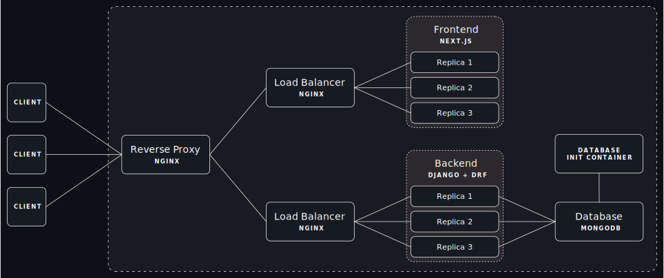

# WikiNetes 📚 + ☸️ = 🫶

A Modern, Cloud-Native, Encyclopedia App 

<i>fig: WikiNetes Application Layout</i>

## Tech Stack 

- **Frontend** : Next.JS

- **Backend** :
	+ Django + Django Rest Framework
	+ PyMongo

- **Database** : MongoDB

- **Load Balancer & Reverse Proxy** : Nginx

## WikiNetes in Action

- [Docker Compose](./docs/compose.md)
- Docker Swarm --> coming soon
- Kubernetes --> coming soon