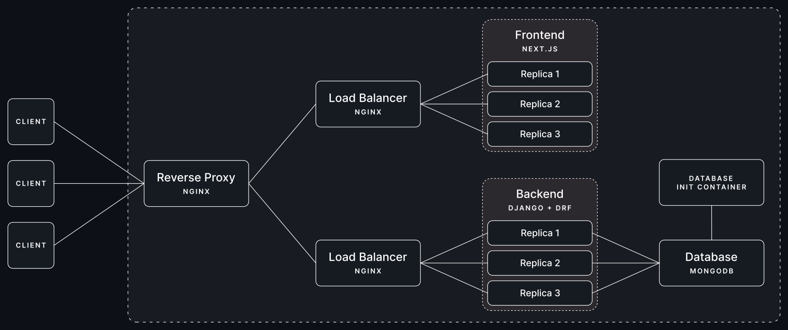

# WikiNetes on Docker Compose


<div align='center'><i>fig: WikiNetes Application Layout on Docker Compose </i></div>

## Steps to deploy on Docker Compose

**Step 1**: Clone this repo 
``` bash
git clone https://github.com/thekarananand/wikiNetes
```

**Step 2**: Build & Deploy Docker Compose Stack
``` bash
cd ./wikiNetes
docker compose up -d --build
```

**Step 3**: It's Ready, Go to [localhost:80](http://localhost:80).
